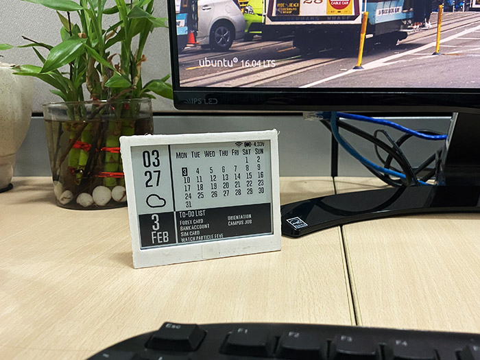

# TimCal

## Install Library Dependencies (from arduino library manager)
  - Adafruit GFX library by Adafruit (tested with v1.7.5)
  - GxEPD by Jean-Marc Zingg version (tested with v3.0.9)
  - JSON Streaming Parser by Daniel Eichhorn (tested with v1.0.5)

## Usage
### Step 1:
Use [ESP32 Sketch data upload](https://randomnerdtutorials.com/install-esp32-filesystem-uploader-arduino-ide/) to upload the icons from data folder.
### Step 2:
Select `ESP32 Dev module` in arduino `Tools>Board` and hit upload.
### Step 3:
Press the reset button on the back of the board. The board will then broadcast an AP "Paperd.Ink_xxxx".
The AP has a captive portal which will help configure the device. When you connect your phone to the AP,
your phone should automatically take you to the configuration page to select SSID, password, todoist API key, etc.
If not, open up a browser and connect to `192.168.1.1`.
The time zone string must be from this [list](https://github.com/nayarsystems/posix_tz_db/blob/master/zones.csv).

   

Alternatively, if you prefer config files, checkout [timcal2](https://github.com/paperdink/timcal2)
